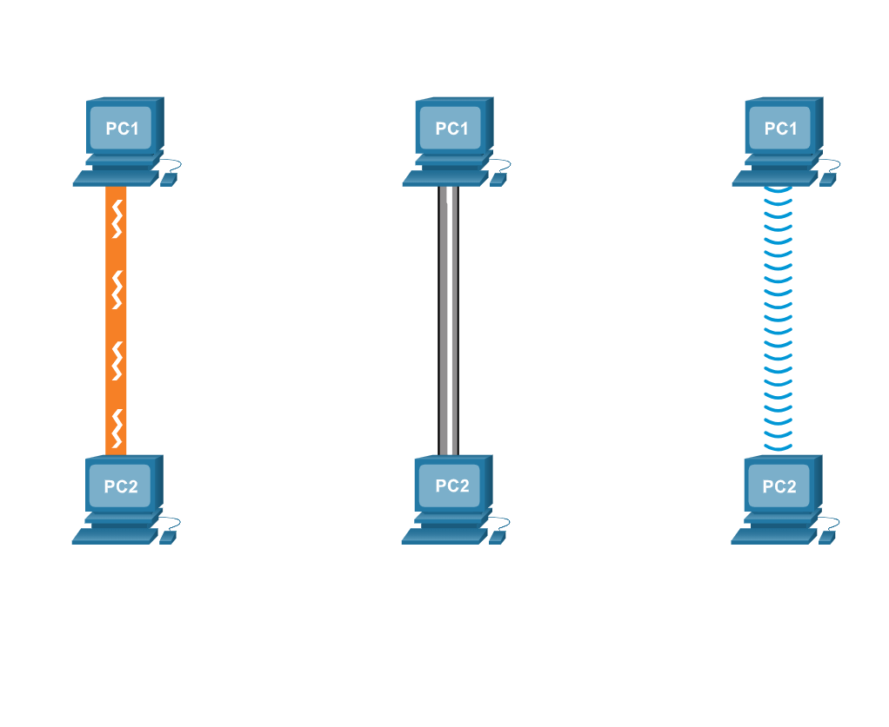

# **Data Transmission**

---

## **1. What is The Data?**

Data, in its raw form, is the information collected from various sources. It can be in the form of numbers, text, images, audio, or video. Data can be categorized into two main types: **Structured** and **Unstructured**. 

- **Structured Data**: This type of data is organized into a specific format, making it easy to search, analyze, and process. Structured data is typically found in relational databases and includes information like numbers, dates, and categories.

- **Unstructured Data**: Unstructured data does not conform to a specific structure or format. It may include text documents, images, videos, and other data that is not easily organized or analyzed without additional processing.

### Types of Data:
1. **Volunteer Data**: Collected from volunteers, such as survey responses or user-generated content.
2. **Inferred Data**: Inferred from other data, such as predicting customer behavior based on purchase history.
3. **Observed Data**: Collected through direct observation or recorded actions, such as sensor data or video footage.

---

## **2. The Bit**

Did you know that computers and networks only work with binary digits—zeros and ones? It can be difficult to imagine that all of our data is stored and transmitted as a series of bits. Each bit can have one of two possible values: 0 or 1. The term **bit** is an abbreviation for "binary digit" and represents the smallest piece of data. While humans interpret words and pictures, computers interpret only patterns of bits.

### How a Bit Works:
A bit is stored and transmitted as one of two possible discrete states, which can include:
- Two directions of magnetization
- Two distinct voltage or current levels
- Two levels of light intensity

For example, a light switch can be either On or Off; in binary, these states would correspond to 1 and 0, respectively.

Every input device (e.g., mouse, keyboard, voice-activated receiver) will translate human interaction into binary code for the CPU to process and store. Output devices (e.g., printer, speakers, monitors) take binary data and translate it back into human-readable forms.

### ASCII Representation
Computers use binary codes to represent and interpret letters, numbers, and special characters. A common code used is **ASCII** (American Standard Code for Information Interchange). In ASCII, each character is represented by eight bits. For example:

- Capital letter: **A = 01000001**
- Number: **9 = 00111001**
- Special character: **# = 00100011**

Each group of eight bits is known as a **byte**. Codes can represent almost any type of information digitally, including computer data, graphics, photos, voice, video, and music.

---

## **3. Common Methods of Data Transmission**

After the data is transformed into a series of bits, it must be converted into signals that can be sent across the network media to its destination. **Media** refers to the physical medium on which the signals are transmitted. Examples of media include copper wire, fiber-optic cables, and electromagnetic waves through the air.

A signal consists of electrical or optical patterns that are transmitted from one connected device to another. These patterns represent the digital bits (i.e., the data) and travel across the media from source to destination as either:
- Pulses of electricity (electrical signals)
- Pulses of light (optical signals)
- Radio waves (wireless signals)

Signals may be converted many times before ultimately reaching the destination, as the corresponding media changes between source and destination.

### Three Common Methods of Signal Transmission:

1. **Electrical Signals**: Transmission is achieved by representing data as electrical pulses on copper wire.
2. **Optical Signals**: Transmission is achieved by converting the electrical signals into light pulses.
3. **Wireless Signals**: Transmission is achieved using infrared, microwave, or radio waves through the air.

In most homes and small businesses, network signals are transmitted across copper wires (cables) or Wi-Fi-enabled wireless connections. Larger networks employ fiber-optic cables to reliably carry signals over longer distances.

---
