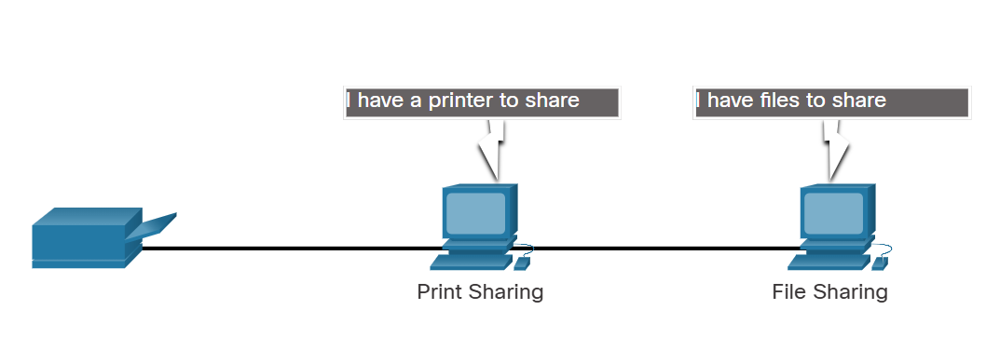

# **Clients and Servers**

---

## **1. Client and Server Roles**

All computers connected to a network that participate directly in network communication are classified as hosts. Hosts can send and receive messages on the network. In mordern networks, computer hosts can act as a client, a server, or both. The software installed on the computer determines which role the computer plays.

Servers are hosts that have software installed which enable them to provide informarion, like email or web pages, to other hosts on the network. Each service requires seperate server software. For example, a host requires web server software in order to provide to you by a server located somewhere on a network that is connected to the global internet.

Client are computer hosts that have software installed that enables the hosts to request and display the information obtained from the server. An example of client software is a web browser, such as Internet Explorer, Safari, Chrome...

| Type  | Description                                                                                                                        |
| ----- | ---------------------------------------------------------------------------------------------------------------------------------- |
| Email | The email server runs email server software. Client use mail client software to access email on the server.                        |
| Web   | The web server runs web server software. Client use browser software to access web pages on the server.                            |
| File  | The file server stores corporate and user files in a central location. The client devices access these files with client software. |

---

## **2. Peer-to-Peer Networks**

Client and server software usually run on separate computers, but it is also possible for one computer to run both client and server software at the same time. In small businesses and homes, many computers function as the servers and clients on the network. This type of network is called a **peer-to-peer (P2P) network**.

The simplest P2P network consists of two directly connected computers using either a wired or wireless connection. Both computers are then able to use this simple network to exchange data and services with each other, acting as either a client or a server as necessary.

Multiple PCs can also be connected to create a larger P2P network, but this requires a network device, such as a switch, to interconnect the computers.

The main disadvantage of a P2P environment is that the performance of a host can be slowed down if it is acting as both a client and a server at the same time. In larger businesses, because of the potential for high amounts of network traffic, it is often necessary to have dedicated servers to support the number of service requests.

***The advantages of peer-to-peer networking:***
- Easy to set up
- Less complex
- Lower cost because network devices and dedicated servers may not be required
- Can be used for simple tasks such as transferring files and sharing printers

***The disadvantages of peer-to-peer networking:***
- No centralized administration
- Not as secure
- Not scalable
- All devices may act as both clients and servers which can slow their performance

---

## **3. Peer-to-Peer Applications**

A P2P application allows a device to act as both a client and a server within the same communication. In this model, every client is a server and every server is a client. P2P applications require that each end device provide a user interface and run a background service.

Some P2P applications use a hybrid system where resource sharing is decentralized, but the indexes that point to resource locations are stored in a centralized directory. In a hybrid system, each peer accesses an index server to get the location of a resource stored on another peer.

---

## **4. Multiple Roles in the Network**

A computer with server software can provide services simultaneously to one or many clients.

Additionally, a single computer can run multiple types of server software. In a home or small business, it may be necessary for one computer to act as a file server, a web server, and an email server.

A single computer can also run multiple types of client software. There must be client software for every service required. With multiple clients installed, a host can connect to multiple servers at the same time. For example, a user can check email and view a web page while instant messaging and listening to internet radio.

---
