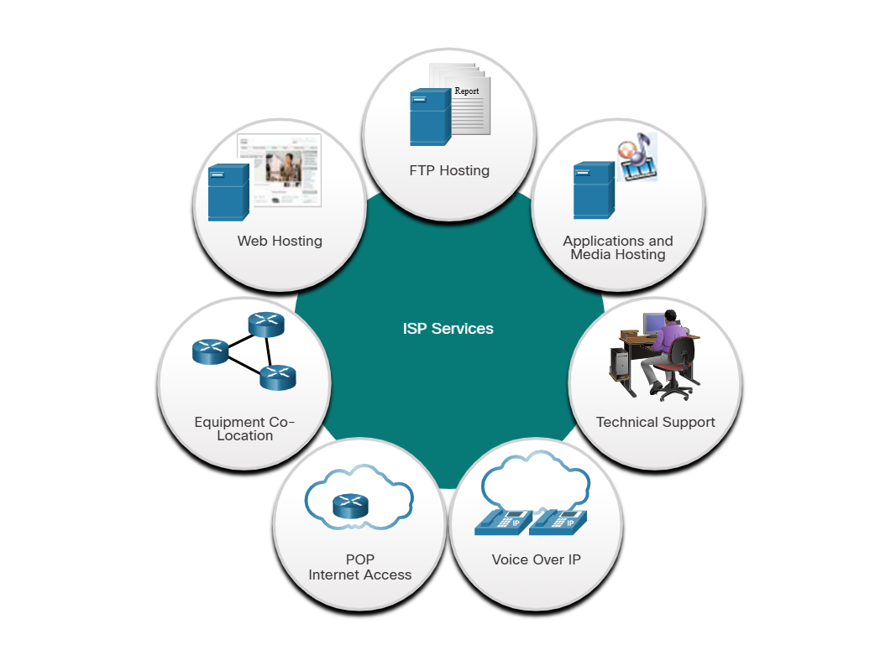
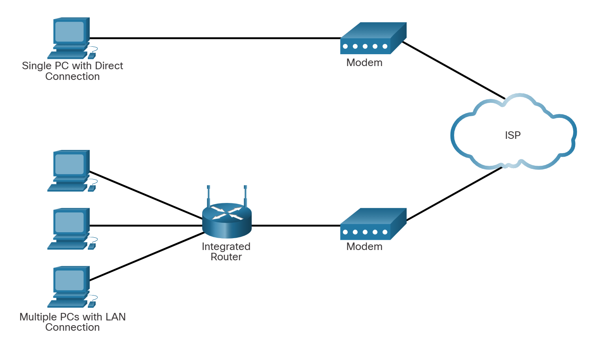
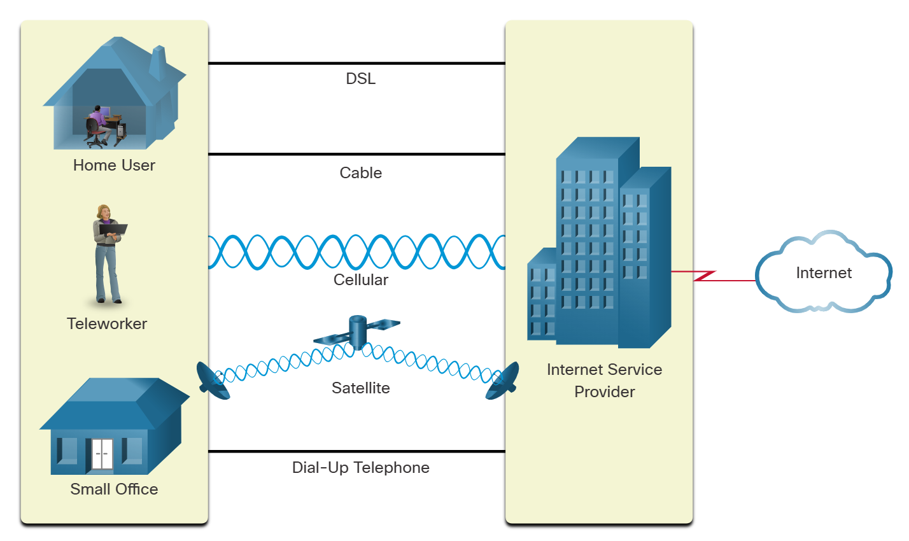

# **ISP Connectivity Options**

---

## **1. ISP Services**

An Internet Service Provider (ISP) provides the link between the home network and the internet. An ISP can be the local cable provider, a landline telephone service provider, the cellular network that provides your smartphone service, or an independent provider who leases bandwidth on the physical network infrastructure of another company.

Many ISPs also offer additional services to their contract subscribers, as shown in the figure. These services can include email accounts, network storage, and website hosting and automated backup or security services.

ISPs are critical to communications across the global internet. Each ISP connects to other ISPs to form a network of links that interconnect users all over the world. ISPs are connected in a hierarchical manner that ensures that internet traffic generally takes the shortest path from the source to the destination.

The internet backbone is like an information super highway that provides high-speed data links to connect the various service provider networks in major metropolitan areas around the world. The primary medium that connects the internet backbone is fiber-optic cable. This cable is typically installed underground to connect cities within continents. Fiber-optic cables also run under the sea to connect continents, countries, and cities.

---

## **2. ISP Connections**

The interconnection of ISPs that forms the backbone of the internet is a complex web of fiber-optic cables with expensive networking switches and routers that direct the flow of information between source and destination hosts. Average home users are not aware of the infrastructure outside of their network. For a home user, connecting to the ISP is a fairly uncomplicated process.

The top portion of the figure displays the simplest ISP connection option. It consists of a modem that provides a direct connection between a computer and the ISP. This option should not be used though, because your computer is not protected on the internet.

As shown in the bottom portion of the figure, a router is required to securely connect a computer to an ISP. This is the most common connection option. It consists of using a wireless integrated router to connect to the ISP. The router includes a switch to connect wired hosts and a wireless AP to connect wireless hosts. The router also provides client IP addressing information and security for inside hosts.

---

## **3. Cable and DSL Connections**

Most home network users do not connect to their service providers with fiber-optic cables. The figure illustrates common connection options for small office and home users. The two most common methods are as follows:

- Cable - Typically offered by cable television service providers, the internet data signal is carried on the same coaxial cable that delivers cable television. It provides a high bandwidth, always on, connection to the internet. A special cable modem separates the internet data signal from the other signals carried on the cable and provides an Ethernet connection to a host computer or LAN.
- DSL - Digital Subscriber Line provides a high bandwidth, always on, connection to the internet. It requires a special high-speed modem that separates the DSL signal from the telephone signal and provides an Ethernet connection to a host computer or LAN. DSL runs over a telephone line, with the line split into three channels. One channel is used for voice telephone calls. This channel allows an individual to receive phone calls without disconnecting from the internet. A second channel is a faster download channel, used to receive information from the internet. The third channel is used for sending or uploading information. This channel is usually slightly slower than the download channel. The quality and speed of the DSL connection depends mainly on the quality of the phone line and the distance from the central office of your phone company The farther you are from the central office, the slower the connection.

---

## **4. Additional Connectivity Options**

Other ISP connection options for home users include the following:
| **Connectivity Option** | **Description** | **Advantages** | **Disadvantages** |
| --- | --- | --- | --- |
| Cellular | Cellular internet access uses a cell phone network to connect. Wherever you can get a cellular signal, you can get cellular internet access. | Availability in areas with no internet connectivity, mobility | Limited performance, metered bandwidth usage, extra charges for exceeding contract data plan |
| Satellite | Satellite service is a good option for homes or offices that do not have access to DSL or cable. Satellite dishes require a clear line of sight to the satellite. | Availability in areas with no internet connectivity, generally good speeds | High equipment and installation costs, moderate monthly fee, potential for overhead obstructions |
| Dial-up Telephone | An inexpensive option that uses any phone line and a modem. To connect to the ISP, a user calls the ISP access phone number. | Inexpensive, useful for mobile access while traveling | Low bandwidth, not sufficient for large data transfer, only suitable when higher speed options are not available |

In metropolitan areas, many apartments and small offices are being connected directly with fiber-optic cables. This enables an internet service provider to provide higher bandwidth speeds and support more services such as internet, phone, and TV.

The choice of connection varies depending on geographical location and service provider availability.