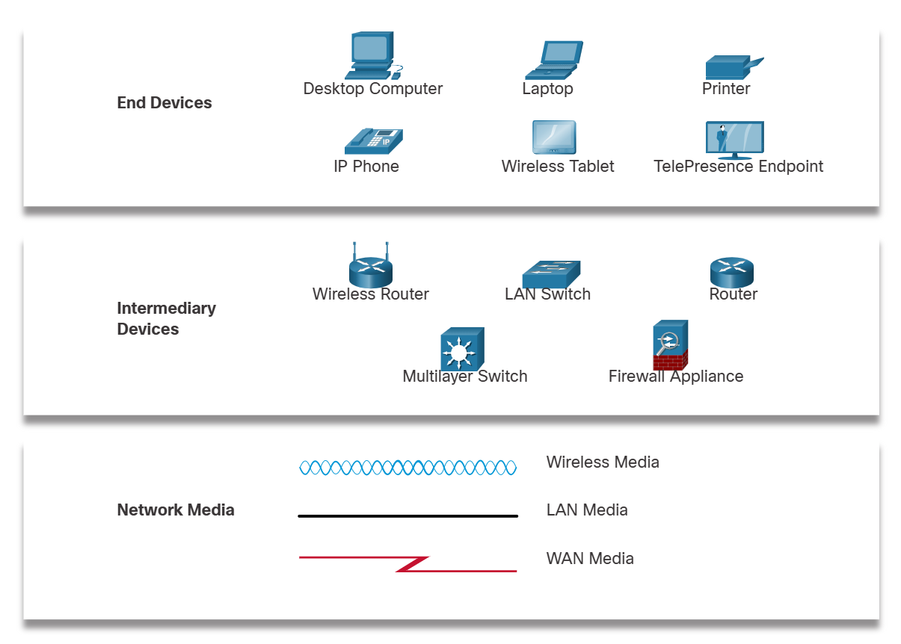

# **Network Components**

---

## **1. Network Infrastructure**

The path that a message takes from its source to destination can be as simple as a single cable connecting one computer to another, or as complex as a network that literally spans the globe. This network infrastructure is the platform that supports the network. It provides the stable and reliable channel over which our communications can occur.

The network infrastructure contains three categories of hardware components, as shown in the figure:

- End devices
- Intermediate devices
- Network media

Devices and media are the physical elements, or hardware, of the network. Hardware is often the visible components of the network platform such as a laptop, PC, switch, router, wireless access point, or the cabling used to connect the devices. Occasionally, some components may not be so visible. In the case of wireless media, messages are transmitted through the air using invisible radio frequencies or infrared waves.

---

## **2. End Devices**

The network devices that people are most familiar with are called end devices, or hosts. These devices form the interface between users and the underlying communication network.

Some examples of end devices are as follows:

Computers (workstations, laptops, file servers, web servers)
Network printers
Telephones and teleconferencing equipment
Security cameras
Mobile devices (such as smart phones, tablets, PDAs, and wireless debit/credit card readers and barcode scanners)
An end device (or host) is either the source or destination of a message transmitted over the network, as shown in the animation. In order to uniquely identify hosts, addresses are used. When a host initiates communication, it uses the address of the destination host to specify where the message should be sent.

