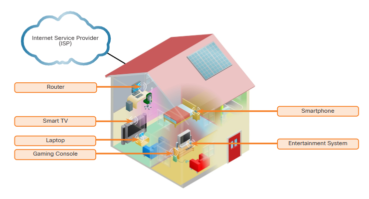
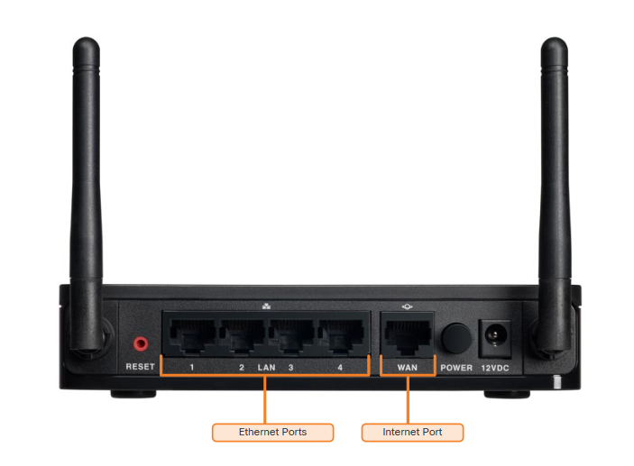

# **Home Network Basics**

---

## **1. Typical Home Network Setup**

Most home networks consist of at least two separate networks. The first network is the public network that comes in from the service provider. Usually, in a home, this would be a cable provider or a DSL provider. The DSL provider or cable provider network does not use the same protocols and transmission methods as an Ethernet network. The second network is the Ethernet network used to connect devices within the home. This network is usually a switched Ethernet network. The devices on this network are typically connected to a router or a switch. The router is usually connected to the public network, and the switch is usually connected to the router.

---

## **2. Components of a Home Network**

In addition to an integrated router, many different types of devices might be connected to a home network, as shown in the figure. Here are a few examples:

- Desktop computers  
- Gaming systems  
- Smart TV systems  
- Printers  
- Scanners  
- Security cameras  
- Telephones  
- Climate control devices  

As new technologies emerge, more household functions will rely on the network to provide connectivity and control.

### **Home Wireless Local Area Network (WLAN)**

---

## **3. Typical Home Network Routers**

Small business and home routers typically have two primary types of ports:

- **Ethernet Ports**: These ports connect to the internal switch portion of the router. These ports are usually labeled “Ethernet” or “LAN,” as shown in the figure. All devices connected to the switch ports are on the same local network.
- **Internet Ports**: This port connects the device to another network. The internet port connects the router to a different network than the Ethernet ports. This port is often used to connect to the cable or DSL modem to access the internet.

In addition to the wired ports, many home routers include a radio antenna and a built-in wireless access point. By default, wireless devices are on the same local network as the devices physically plugged into the LAN switch ports. The internet port is the only port that is on a different network in the default configuration.

---