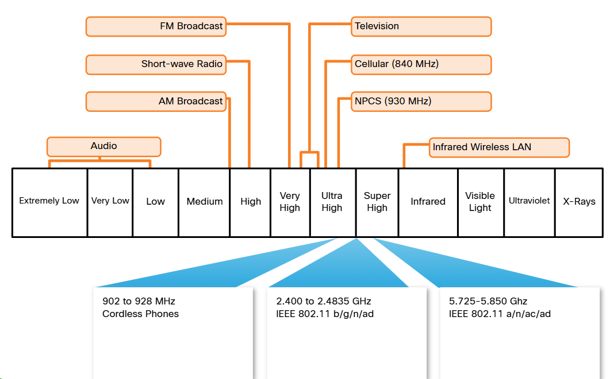
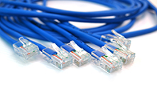

# **Network Technologies in the Home**

---

## **1. LAN Wireless Frequencies**

The wireless technologies most frequently used in home networks are in the unlicensed 2.4 GHz and 5 GHz frequency ranges.

Bluetooth is a technology that makes use of the 2.4 GHz band. It is limited to low-speed, short-range communications, but has the advantage of communicating with many devices at the same time. This one-to-many communication has made Bluetooth technology the preferred method for connecting computer peripherals such as wireless mice, keyboards and printers. Bluetooth is a good method for transmitting audio to speakers or headphones.

Other technologies that use the 2.4 GHz and 5 GHz bands are the modern wireless LAN technologies that conform to the various IEEE 802.11 standards. Unlike Bluetooth technology, 802.11 devices transmit at a much higher power level giving them a great range and improved throughput. Certain areas of the electromagnetic spectrum can be used without a permit.

The figure shows where wireless technologies exist on the electromagnetic spectrum.

---

## **2. Wired Network Technologies**

Although many home network devices support wireless communications, there are still a few applications where devices benefit from a wired switch connection that is not shared with other users on the network.

The most commonly implemented wired protocol is the Ethernet protocol. Ethernet uses a suite of protocols that allow network devices to communicate over a wired LAN connection. An Ethernet LAN can connect devices using many different types of wiring media.

Directly connected devices use an Ethernet patch cable, usually unshielded twisted pair. These cables can be purchased with the RJ-45 connectors already installed, and they come in various lengths. Recently constructed homes may have Ethernet jacks already wired in the walls of the home. For those homes that do not have UTP wiring, there are other technologies, such as powerline, that can distribute wired connectivity throughout the premises.

| Types                  | Description                                                                                                                                                                                                                                                                           | Picture                      |
| ---------------------- | ------------------------------------------------------------------------------------------------------------------------------------------------------------------------------------------------------------------------------------------------------------------------------------- | ---------------------------- |
| **Category 5e**        | Category 5e is the most common wiring used in a LAN. The cable is made up of 4 pairs of wires that are twisted to reduce electrical interference.                                                                                                                                     |  |
| **Coaxial cable**      | Coaxial cable has an inner wire surrounded by a tubular insulating layer, that is then surrounded by a tubular conducting shield. Most coax cables also have an external insulating sheath or jacket.                                                                                 |  |
| **Fiber-optic cables** | Fiber-optic cables can be either glass or plastic with a diameter about the same as a human hair and it can carry digital information at very high speeds over long distances. Fiber-optic cables have a very high bandwidth, which enables them to carry very large amounts of data. |  |

---
