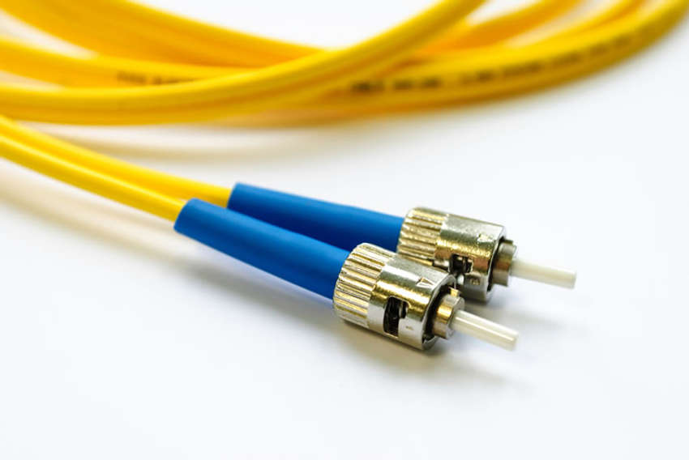

# **Network Technologies in the Home**

---

## **1. LAN Wireless Frequencies**

Home networks commonly use wireless technologies operating in the unlicensed **2.4 GHz** and **5 GHz** frequency bands.

- **Bluetooth** operates in the 2.4 GHz band, supporting low-speed, short-range communication. It is widely used for connecting peripherals such as wireless mice, keyboards, printers, and audio devices like speakers and headphones.
- **Wi-Fi (IEEE 802.11 standards)** uses both 2.4 GHz and 5 GHz bands. Unlike Bluetooth, Wi-Fi operates at higher power levels, providing greater range and improved data throughput.
- **Electromagnetic Spectrum Usage**: Certain frequency bands are unlicensed, meaning they can be used without a permit. The figure below illustrates where different wireless technologies exist on the electromagnetic spectrum.

---

## **2. Wired Network Technologies**

Despite the convenience of wireless networking, many home devices benefit from a wired connection for improved speed, stability, and security. The most common wired networking technology is **Ethernet**, which provides reliable communication over a Local Area Network (LAN).

### **Types of Wired Connections**

| **Type**                | **Description**                                                                                                                        | **Picture**                      |
| ----------------------- | -------------------------------------------------------------------------------------------------------------------------------------- | -------------------------------- |
| **Category 5e (Cat5e)** | Most common LAN cable, consisting of four twisted pairs to reduce interference. Supports up to 1 Gbps speeds.                          |  |
| **Coaxial Cable**       | Features an inner wire surrounded by insulation and a conductive shield. Often used for cable internet and television services.        |   |
| **Fiber-optic Cable**   | Uses glass or plastic fibers to transmit data as light pulses. Offers very high bandwidth and long-distance transmission capabilities. |  |

### **Advantages of Wired Connections Over Wireless**

- **Higher Stability**: Not affected by signal interference or distance-related degradation.
- **Lower Latency**: Essential for real-time applications such as online gaming and video conferencing.
- **Enhanced Security**: Less susceptible to eavesdropping or unauthorized access.
- **Dedicated Bandwidth**: Unlike Wi-Fi, wired connections do not share bandwidth with multiple devices on the same frequency.

### **Common Ethernet Standards**

| **Ethernet Standard**       | **Speed**     | **Max Distance** | **Cable Type**              |
| --------------------------- | ------------- | ---------------- | --------------------------- |
| **Fast Ethernet**           | 100 Mbps      | 100m             | Cat5                        |
| **Gigabit Ethernet**        | 1 Gbps        | 100m             | Cat5e, Cat6                 |
| **10 Gigabit Ethernet**     | 10 Gbps       | 55m – 100m       | Cat6a, Cat7                 |
| **40/100 Gigabit Ethernet** | 40 – 100 Gbps | 7m – 40km        | Cat8 (short) or fiber optic |

### **Ethernet in Home Networks**

1. **Direct Connection via Ethernet Cable**: Devices such as PCs, gaming consoles, Smart TVs, and security cameras can be connected directly to the router or switch using RJ-45 Ethernet cables.
2. **Built-in Ethernet Wall Wiring**: Some modern homes include pre-installed Ethernet ports in the walls for seamless connectivity.
3. **Alternative Wired Networking Technologies**:
   - **Powerline Networking**: Uses existing electrical wiring to extend network connections. A powerline adapter connects to a power outlet near the router, with another placed where wired connectivity is needed. While slower than Ethernet, it is more stable than Wi-Fi.
   - **MoCA (Multimedia over Coax Alliance)**: Uses existing coaxial TV cables to distribute network signals, ideal for homes with cable TV wiring but no Ethernet infrastructure.

---
