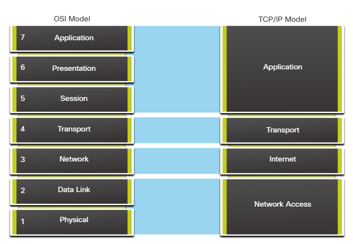

# **Network Communication Models**

---

## **1. The TCP/IP Model**

Layered models help us visualize how the various protocols work together to enable network communications. A layered model depicts the operation of the protocols occuring within each layer, as well as the interaction with the layers above and below it. The layered model has many benefits:

- Assists in protocol design, because protocols that operate at a specific layer have defined information that they act upon and a defined interface to the layers above and below them.
- Foster competition because products from different vendors can work together.
- Enables technology changes to occur at one level without affecting the other levels.
- Provides a common language to decribe netwroking functions and capabilities.

The first layered model for internetwork communications was created in the early 1970s and is refered to as the internet model. It defines 4 categories of functions that occur in order for communications to be successful. The suite of TCP/IP protocols that are used for internet communications is based on this model.

| TCP/IP Model Layer   | Description                                                                                 |
| -------------------- | ------------------------------------------------------------------------------------------- |
| Application Layer    | Provides services to end-user applications, such as email, file transfer, and web browsing. |
| Transport Layer      | Provides reliable data transfer between devices.                                            |
| Internet Layer       | Routes data between devices on different networks.                                          |
| Network Access Layer | Defines how data is transmitted over a physical network.                                    |

---

## **2. The OSI Reference Model**

There are 2 basic types of models that we use to describe the functions that must occur in order for network communications to be successful: protocol models and reference models.

- Protocol model: This model closely matches the structure of a particular protocol suite. A protocols suite includes the set of related protocols that typically provide all the functionality required for people to communicate with the data network. The TCP/IP model us a protocols model because it describes the functions that occur at each layer of protocols within the TCP/IP suite.
- Reference model: This type of model decribes the functions that must be completed at a particular layer, but does not specify exactly how a function should be accomplished. A reference model is not intended to provide a sufficient level of a reference model is to aid in clearer understanding of the functions and processes necessary for network communications.
  The OSI reference model is a reference model. It is a 7-layered model that is widely used to describe the functions that must occur in order for network communications to be successful. The OSI reference model is a reference model because it describes the functions that must be completed at each layer, but does not specify exactly how a function should be accomplished.

| OSI Model Layer    | Description                                                                                                                                                                                                                                |
| ------------------ | ------------------------------------------------------------------------------------------------------------------------------------------------------------------------------------------------------------------------------------------ |
| Application Layer  | The application layer contains protocols used for process-to-process communication. These protocols are used to support functions such as email, file transfer, and web browsing.                                                          |
| Presentation Layer | The presentation layer is responsible for converting data into a format that can be understood by the receiving device. This layer is also responsible for encryption and decryption.                                                      |
| Session Layer      | The session layer is responsible for establishing, maintaining, and terminating connections between applications . It is also responsible for controlling the dialogue between applications.                                               |
| Transport Layer    | The transport layer is responsible for providing reliable data transfer between devices. It is also responsible for controlling the flow of data and ensuring that data is delivered in the correct order.                                 |
| Network Layer      | The network layer is responsible for routing data between devices on different networks. It is also responsible for providing logical addressing and routing.                                                                              |
| Data Link Layer    | The data link layer is responsible for framing, error detection and correction, and flow control. It is also responsible for providing physical addressing and error-free transfer of data.                                                |
| Physical Layer     | The physical layer is responsible for transmitting raw bits over a physical medium. It is also responsible for defining the electrical, mechanical, procedural, and functional specifications for the physical means of transmitting data. |

---

## **3. Comparison of the TCP/IP and OSI Models**

Because TCP/IP is the protocol suite in use for internet communications, why do we need to learn the OSI model as well?

The TCP/IP model is a method of visualizing the interactions of the various protocols that make up the TCP/IP protocol suite. It does not describe general functions that are necessary for all networking communications. It describes the networking functions specific to those protocols in use in the TCP/IP protocol suite. For example, at the network access layer, the TCP/IP protocol suite does not specify which protocols to use when transmitting over a physical medium, nor the method of encoding the signals for transmission. OSI Layers 1 and 2 discuss the necessary procedures to access the media and the physical means to send data over a network.

The protocols that make up the TCP/IP protocol suite can be described in terms of the OSI reference model. The functions that occur at the internet layer in the TCP/IP model are contained in the network layer of the OSI Model, as shown in the figure. The transport layer functionality is the same between both models. However, the network access layer and the application layer of the TCP/IP model are further divided in the OSI model to describe discrete functions that must occur at these layers.

The key similarities are in the transport and network layers; however, the two models differ in how they relate to the layers above and below each layer:

OSI Layer 3, the network layer, maps directly to the TCP/IP internet layer. This layer is used to describe protocols that address and route messages through an internetwork.
OSI Layer 4, the transport layer, maps directly to the TCP/IP transport layer. This layer describes general services and functions that provide ordered and reliable delivery of data between source and destination hosts.
The TCP/IP application layer includes several protocols that provide specific functionality to a variety of end user applications. The OSI model Layers 5, 6, and 7 are used as references for application software developers and vendors to produce applications that operate on networks.
Both the TCP/IP and OSI models are commonly used when referring to protocols at various layers. Because the OSI model separates the data link layer from the physical layer, it is commonly used when referring to these lower layers.