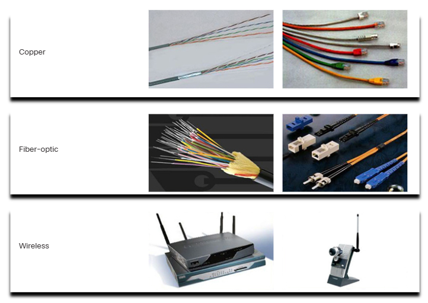
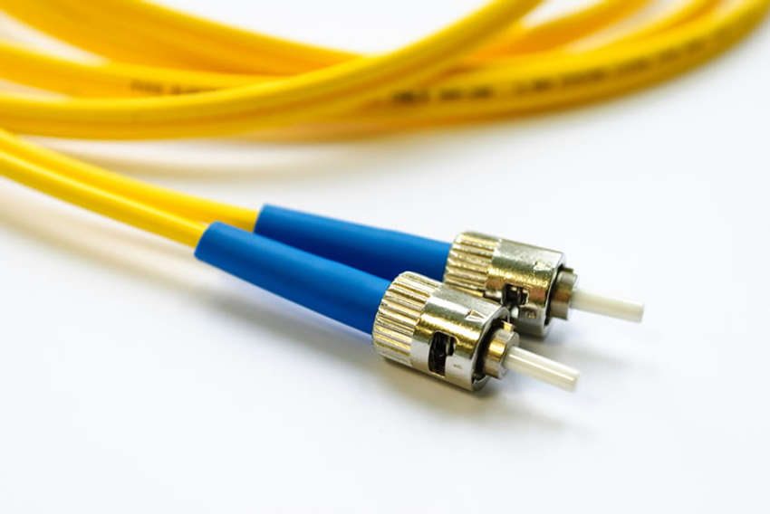
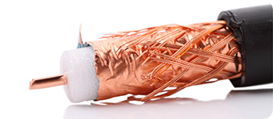

# **Network Media Types**  

## **1. Network Media Types**  

Network media provides the connectivity and path for communication in a network. Connections can be:  
- **Wireless:** Data is transmitted through the air without a physical medium.  
- **Wired:** Data is transmitted using copper or fiber optic cables.  

### **Common Network Connectors**  
- **RJ-45 Connector** – Standard Ethernet connector (8P8C modular connector).  
- **Coaxial Connectors** – Used for cable TV and network connections.  
  - **BNC Connector** – A common coaxial connector.  
  - **F-Type Connector** – Used for cable television.  
- **Fiber Optic Connectors** – Used for high-speed, long-distance connections.  

---  

## **2. Three Media Types**  

Modern networks use three primary types of media:  

| Media Type         | Transmission Method   |
|--------------------|----------------------|
| **Copper Cables**  | Electrical impulses  |
| **Fiber Optic**    | Pulses of light      |
| **Wireless**       | Electromagnetic waves |

**Factors for Choosing Network Media:**  
- **Distance:** How far the signal needs to travel.  
- **Environment:** Indoor, outdoor, or industrial conditions.  
- **Speed & Bandwidth:** Data volume and transmission speed.  
- **Cost:** Budget for materials and installation.  

**Illustration:**  
  

---  

## **3. Common Network Cables**  

### **1. Twisted-Pair Cable**  
- Most commonly used in **Ethernet networks**.  
- Wires are **twisted in color-coded pairs** to reduce interference.  
- Uses **RJ-45 connectors**. 

  

### **2. Coaxial Cable**  
- Early network cabling type, still used for **cable TV and satellite communication**.  
- Contains:  
  - **Central copper conductor**  
  - **Insulation and shielding** for protection  

 

### **3. Fiber-Optic Cable**  
- Uses **light signals** instead of electrical signals.  
- **Resistant to electrical interference**.  
- Applications include:  
  - **High-speed transmission** in large networks  
  - **Medical imaging and industrial uses**  
  - **Backbone networks and data centers** 

   

---